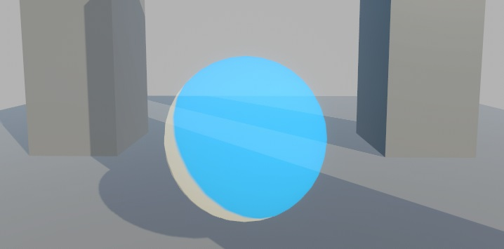

# Gabriel Toon Shader Manual

**WORK IN PROGRESS**

# Sumary
- [What we trying to acomplish?](./GTShader_Manual.md#what-we-trying-to-acomplish?)
  - [Genshin Style](./GTShader_Manual.md#genshin-style)
  - [Guilty Gear Strive Style](./GTShader_Manual.md#guilt-gear-strive-style)
- [The Shader](./GTShader_Manual.md#the-shader)
  - [Configuration](./GTShader_Manual.md#configuration)
  - [Shader Worflow](./GTShader_Manual.md##shader-worflow)
  - [Render Face](./GTShader_Manual.md##render-face)
  - [Surface Type](./GTShader_Manual.md##surface-type)
  - [Receive Shadows](./GTShader_Manual.md##receive-shadows)
- [Is Face?](./GTShader_Manual.md##is-face?)
- [Final Toon Shader Controller](./GTShader_Manual.md##final-toon-shader-controller)

# What we trying to acomplish?

The first thing to question is: “What make a Anime looks like a Anime?”.
Thats alot of style of animes, and each artist have their own way to draw, but we need a guidline to folow to achive something, so lets check de image below:

[Source](https://docs.unity3d.com/Packages/com.unity.toonshader@0.6/manual/instruction.html)

The imagem separate the colors by they intentions:
1 - The hi Color, represents the reflection of the light on a surface.
2 - The base color, that is the lit base color of the character.
3 - The 1st Shade, that is the unlit base color.
4 - The 2st Shade, is like a deep, dark shadow.
I try to achieve these principles with layers of shading, using lerp, and lambert methods for calculating light, the most common technic, nothing revolutionary here.
Plus the colors there outlines, the lines that define the shape of the character, whereas the silhouette begins and end.

[Source](https://img.freepik.com/premium-vector/drawing-process-young-man-anime-style-character-vector-illustration-design_18591-62206.jpg?w=2000)

Theres a lot of technics to achieve outlines, but in this repository I focus on the basic, inverted hull method that a will explain later.

# Genshin Style

Genshin Impact is a game developed by miHoYo, is a Chinese company, that make games with an anime style. The texture pipeline for achieving this visual, is not too much different than a PBR pipeline, they use the same pipeline texture, like albedo texture, normal map, height map, and so on. The differences are that they divide the enviroment and the character in two render pipelines, where's the character pipeline focus and achieving and more accurate anime style, and the environment focuses on a more waterpaint style, that works really well together.

[Here you can watch the miHoYo talk about the render pipelines](https://www.youtube.com/watch?v=egHSE0dpWRw&ab_channel=UnityKorea)

# Guilty Gear Strive Style

Arc System Works, create something new on the release of their game Guilty Gear Xrd -SIGN-, making 3D models look as like a 2D sprite.

Is not perfect, but is impressive how close did they get. They develop some technics to achieve this look by using a lot of data manipulation, using textures and vertex color as data to give artists the most control they can about the model, and how light will affect the model.

[Here you can watch the 2015 GDC talk about their workflow](https://www.youtube.com/watch?v=yhGjCzxJV3E&ab_channel=GDC)

I will try my best to explain the differences of each style in this manual, and how I incorporated this on my shader.

# The Shader

Lets talk about the shader and the configuration.

You can acess the shader in the Shader menu in the material, in the section **"GabrielShaders"**.

And this is the custom edior for the shader.

# Configuration

The first foldout present is the **Configuration**, lets breakdown the options.

## Shader Worflow

This option will change some intern shader calculations and enable/disable texture slots.

**Standard**: This option is for a normal PBR workflow, like genshin style, this mode will not added new texture slots.

**GG Strive**: This option is for a Arc System workflow, like GG Strive, this mode will added new texture slots, that is need for this workflow, and will enable vertex colors ajusts.

## Render Face

This option is to choose which face will render.

**Front**: This option will enable render the mesh front faces.

**Back**: This option will enable render the mesh back faces.

**Both**: This option will enable render both faces.

## Surface Type

This option is to choose the surface type.

**Opaque**: This option the material is treated as opaque object.

**Transparent**: This option the material is treated as transparent object, and will enable the blend mode option.

The transparency is controlled by the alpha channel of the base color.

Alpha blend example.

Additive blend example

## Receive Shadows

This option will enable/disable the material to receive shadows casted by others objects, this will not enalbe shadow casting(you enable/disable shadow casting in the rendering component).

# Is Face?

This option will enable/disable the shadow mask texture.

When you make the shadows a harsh change without blend, artificats can appear, and the face is the most commum place to this to happen.

[Source](https://www.4gamer.net/games/216/G021678/20140703095/)

Genshin workflow minimaze this by using a texture as a shadow mask ramp, especific for the face, so you bypass the artifacts. Arc System dont use texture, **they change the normals vectors for each vertex in the face, by hand**, (personal tough: so much respect for their work!!).

Example of the genshin mask.

By enable this option, will appear new options and the texture slot for this mask.

## Shadow Mask Options

**Mask Vertical** - This is a mask for the shadow in the face, but only in vertical position, theres no up down shadows.

Shadow Mask Ramp example.

With Color.

**Mask Horizontal** - This is a mask, is my own solution, for the shadow in the horizontal position, up down shadows. This mask dont exist in any of the workflow. Theres a catch in this mask, because i need to rotate the uvs, this mask works like a multidirectional shadow ramp.

Shadow Mask Ramp example.

With Color.

**Both** - Use both mask together.

Heres some links can be helpfull for creating your won shadow mask.

[Get *PERFECT* Anime Face Shadows (Easier Way) in Blender](https://www.youtube.com/watch?v=x-K6bCAl6Qs&t=409s&ab_channel=2AM)
[Blender Anime Face Texture Shadow ENG SUB | Nhij Quang](https://www.youtube.com/watch?v=VcaRAhif9ec&t=0s&ab_channel=NhijQuang)
[Shader facial anime Genshin Impact in blender](https://www.youtube.com/watch?v=D3nEolOME50&t=0s&ab_channel=AnimeXDchannel)

## Enable Shadow Mask Gradient

The shadow mask represents a linear ramp (from 0 to 1) to represents wich area of the face has light,

# Final Toon Shader Controller