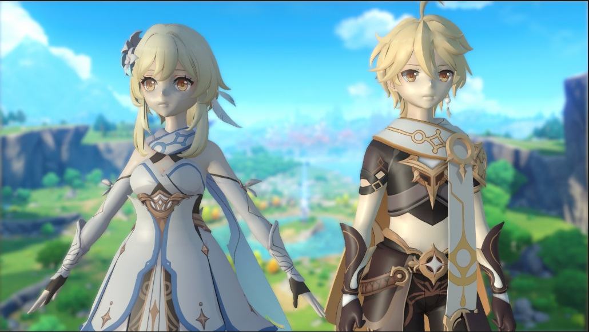
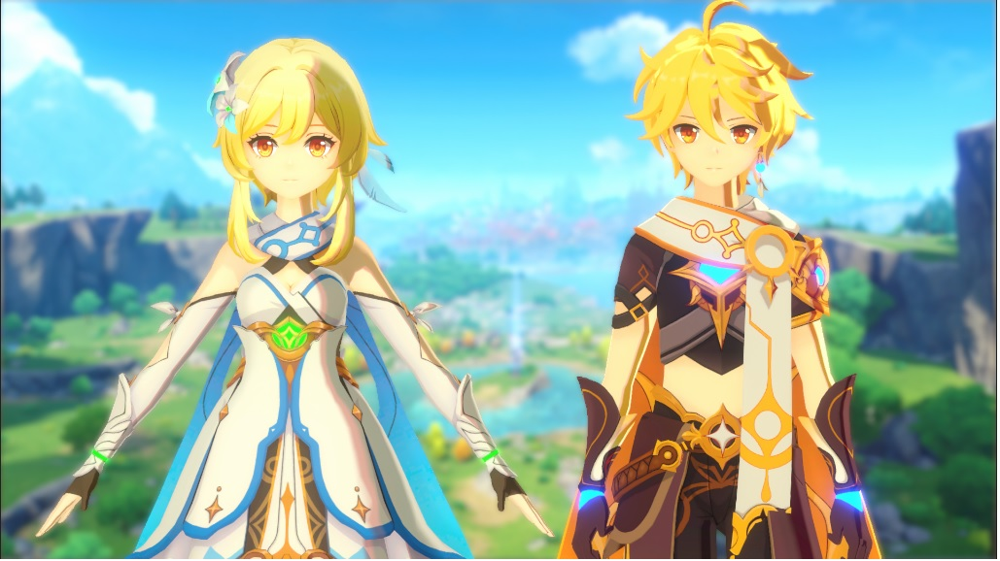
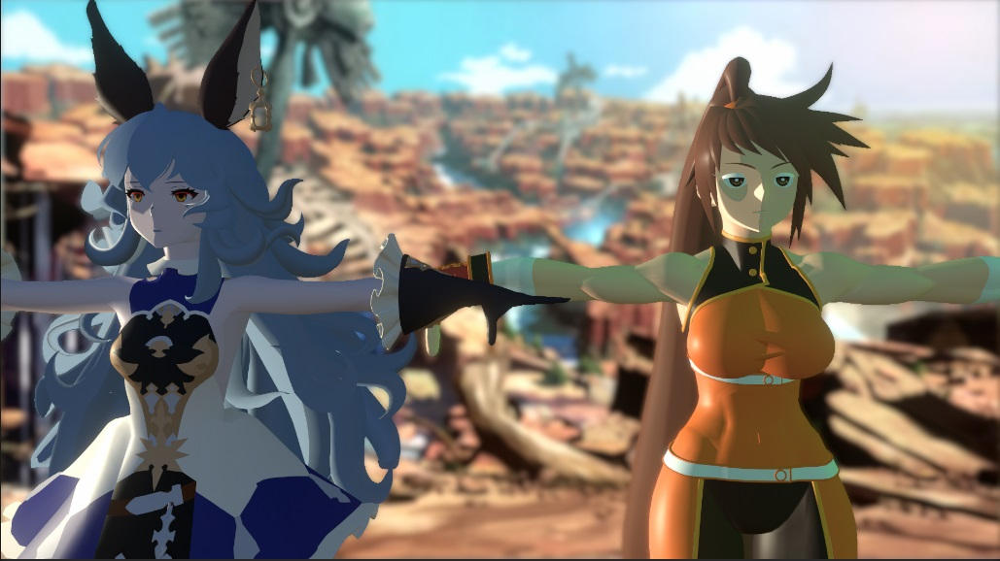
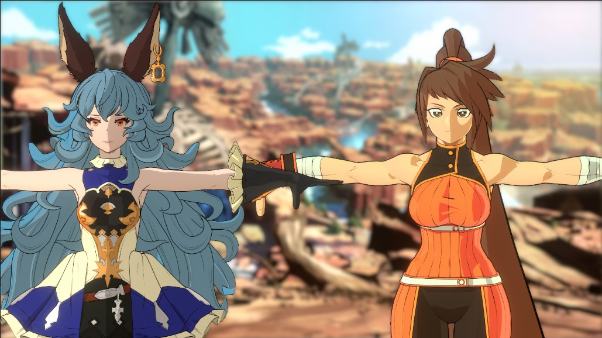

# Gabriel Toon Shader 1.0V

This repository contains my approach to a toon shader. I wanted to learn how to write shaders and to learn the pipeline of an Anime style visual for a game, and this project is the results of that experience.
This repository is the raw project create with Unity 2021.3.3f1, utilizing URP.
The shader is compatible with URP, forward and deferred render path, SRP batching, realtime and baked additional lights.

This repository has a manual, you can acess here:

[Gabriel Toon Shader Manual](Manual/GTShader_Manual.md)

## Portifolio
**Genshin Style**

[Click Here for better quality](https://youtu.be/UaOJl1PHFNs)

**Guilty Gear Strive Style**

[Click Here for better quality](https://youtu.be/DzK9NVt1i4U)

**Genshin without Shader**

**Genshin with Shader**

**Guilty Gear without Shader**

**Guilty Gear with Shader**

